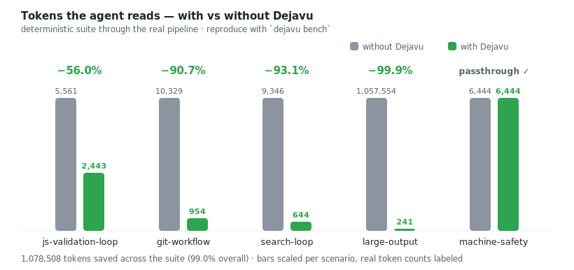

# Dejavu

Stop showing coding agents the same command output twice.

Dejavu is a PATH shim for Claude Code, Codex, Cursor agent, opencode, Aider, Gemini CLI, and other terminal-based coding agents. It always runs the real command, but when output is unchanged or nearly unchanged, it returns only a compact delta instead of flooding the agent context again.

- Works without prompting the agent
- Always preserves exit codes
- Full output is stored locally and recoverable
- Supports common commands like npm, pnpm, yarn, git, rg, grep, pytest, cargo, go, tsc, eslint, and docker logs
- Early benchmark: 52-55% less intercepted output in campaign 2, 87% less output in repeated local rerun loops


## Why This Exists

Coding agents rerun commands constantly: tests, typechecks, `git diff`, search, logs, and build output. Most of those reruns are unchanged or only slightly changed, but the agent still rereads the full output. That wastes context and makes the next step harder to see.

Dejavu is the command-output memory layer for that loop. Your agent keeps running normal shell commands. Dejavu remembers what those command outputs looked like last time and only prints the useful part when they repeat.

## How It Works

`dejavu start <agent>` launches the agent with a shim directory at the front of `PATH`.

```text
agent runs:      pnpm test
PATH resolves:   <dejavu-cache>/shims/bin/pnpm
shim runs:       dejavu run --shim-name pnpm -- test
Dejavu runs:     the real pnpm found later in PATH
Dejavu stores:   redacted stdout, stderr, metadata, exit code
agent receives:  first output, unchanged notice, compact delta, or passthrough
```

The trust claim is simple: Dejavu never skips command execution. It only changes how repeated command output is displayed.

## Installation

Install script (macOS, Linux, WSL):

```bash
curl -fsSL https://raw.githubusercontent.com/Salnika/dejavu/master/install.sh | sh
```

Homebrew:

```bash
brew tap Salnika/dejavu
brew install dejavu
```

npm / npx (the command is still `dejavu`):

```bash
npx @salnika/dejavu start -- codex   # no install
npm install -g @salnika/dejavu       # or install globally
```

Cargo:

```bash
cargo install dejavu-cli
```

Prebuilt binaries for each release are on the
[Releases page](https://github.com/Salnika/dejavu/releases). From source:

```bash
git clone https://github.com/Salnika/dejavu
cd dejavu
cargo install --path .
dejavu doctor
```

More detail: [docs/INSTALL.md](docs/INSTALL.md). Maintainers: [docs/RELEASING.md](docs/RELEASING.md).

## Quickstart

```bash
cd my-project
dejavu start -- codex
```

Use the same pattern for other terminal agents:

```bash
dejavu start -- claude
dejavu start -- aider
dejavu start -- opencode
dejavu start -- gemini
```

Inside that session, the agent keeps using ordinary commands:

```bash
pnpm test
git diff
rg "TODO"
cargo test
docker logs api
```

Bypass Dejavu for one command:

```bash
DEJAVU=off pnpm test
```

Retrieve full output:

```bash
dejavu show latest --stdout
```

Full command reference (every command and option): [docs/CLI.md](docs/CLI.md).

## Global Activation (IDE terminals, GUI-launched agents)

`dejavu start` only covers agents you launch from a terminal. For agents that
run inside an app you launch from the Dock — the VS Code integrated terminal,
Copilot agent mode, IDE extensions — activate the shims globally:

```bash
dejavu shellenv --install     # writes the activation line into your shell profiles
```

This adds a small managed block to `~/.zshrc`, `~/.bashrc`, and `~/.profile`
(idempotent). Target one shell with `--shell zsh|bash|sh`, and undo it with
`dejavu shellenv --uninstall`. Prefer to wire it up yourself? `dejavu shellenv`
(no flag) just prints the line for `eval "$(dejavu shellenv)"`.

Any shell that reads your profile then resolves `npm`, `git`, `rg`, … through
Dejavu, with no `DEJAVU_*` variable needed: the repo context is rebuilt from
the working directory, and shims self-identify to prevent recursion.

Global activation is **agent-gated**: output is reduced only when an agent is
actually reading it — inside a `dejavu start` session, or when the shell
carries an agent marker (`AI_AGENT`, `COPILOT_AGENT`, `CLAUDECODE`, …) *and*
output goes to a terminal. VS Code sets those markers in Copilot's agent
terminals only, so:

- Copilot agent mode gets reduced output;
- your own terminals, scripts, pipelines, `$(git …)`, VS Code tasks and the
  SCM view always get the raw output;
- `DEJAVU_FORCE=1` overrides the gate for custom setups.

Other notes:

- Outside an agent context, shims take a fast path: resolve the real binary
  and exec it — no repo detection, no database, nothing recorded. Your own
  terminal stays at native speed and its history stays out of the cache.
  `DEJAVU=off` still bypasses Dejavu entirely for one command.
- Agents that execute commands without a shell never read your profile and
  are not covered — check with `dejavu doctor` from their terminal.
- `dejavu stats --all` gives the cross-repo view of what global activation
  saves.

To deactivate: `dejavu shellenv --uninstall`.

## Example Output

First run still shows bounded command output:

```text
FAIL tests/session.test.ts
  expected 403, received 200

Tests: 1 failed, 142 passed
Full output: dejavu show 8c51f73 --stdout
```

Unchanged rerun:

```text
dejavu: output unchanged since run 8c51f73.
Command: pnpm test
Exit code: 1

Same failing test:
- tests/session.test.ts expected 403, received 200

Suppressed ~4,820 estimated tokens.
Full output: dejavu show b92d1aa --stdout
Previous output: dejavu show 8c51f73 --stdout
```

Small delta:

```text
dejavu: output changed since run b92d1aa.
Command: pnpm test
Exit code: 1

Changed lines:
- expected 403, received 200
+ expected 403, received 500

Suppressed ~4,610 estimated tokens.
Full output: dejavu show c7a91e2 --stdout
```

The command ran each time. Only the displayed output changed.

## Safety Model

- Dejavu always executes the real underlying command.
- Dejavu does not cache execution results to skip work.
- Dejavu only compresses, deduplicates, or summarizes what is printed back.
- Dejavu preserves the real exit code.
- Dejavu stores full command output locally.
- Dejavu does not send logs to any server.
- Dejavu can be bypassed with `DEJAVU=off` or `DEJAVU_DISABLED=1`.
- Mutating or sensitive commands pass through unless Dejavu explicitly supports a safe read-only form.

Useful checks:

```bash
dejavu doctor
dejavu doctor --json
dejavu repos
dejavu show latest --stdout
dejavu uninstall
```

Full details: [docs/SAFETY.md](docs/SAFETY.md).

## Supported Commands

Dejavu defaults to passthrough. It optimizes only command shapes it recognizes as safe.

| Family | Optimized forms |
|---|---|
| JavaScript package managers | `npm`, `pnpm`, `yarn`, `bun` for `test`, `lint`, `typecheck`, `build` scripts |
| Type and lint | `tsc`, `eslint` without `--fix` or `--fix-dry-run` |
| Tests | `pytest`, `cargo test`, `go test` |
| Search | `rg`, `grep` |
| Files and trees | `find` without side-effecting primaries, `ls`, `tree` |
| Git read-only | `git status`, `git diff`, `git log`, `git show` (human forms only — scripting/machine forms like `--porcelain`, `-s`, `--name-only`, `--numstat`, `--format`, `-z`, `@{upstream}` pass through so shell prompts, IDE SCM, hooks, and `$(git …)` keep parsing them) |
| Logs | `docker logs`, `docker compose logs` |
| Your own commands | anything you list in `[intercept] extra` (see below) |

Add any command you want intercepted via the config — it gets a shim and the
generic reduction (dedup, deltas, bounded summaries, test-runner output
sniffing), with the usual guards (watch modes pass through, execution is never
skipped):

```toml
# ~/.config/dejavu/config.toml
[intercept]
extra = ["vitest", "jest", "make", "terraform"]
```

Examples of commands that pass through unchanged:

- `git commit`, `git push`, `git reset`, `git checkout`, `git add`, `git rebase`
- `docker run`, `docker build`, `docker compose up`, `docker compose down`
- `npm publish`, package installs, interactive init commands
- watch modes and interactive commands
- anything Dejavu cannot confidently classify

## Benchmark Summary

The built-in suite (`dejavu bench`) drives the real classify + reduce pipeline
over deterministic scenarios — anyone can reproduce these numbers locally, and
CI fails if they regress (`dejavu bench --check`):

<picture>
  <source media="(prefers-color-scheme: dark)" srcset="docs/assets/benchmark-dark.svg">
  
</picture>

What each scenario simulates:

| Scenario | Simulates | Why it matters |
|---|---|---|
| `js-validation-loop` | 5× `pnpm test` walking every state: fail → identical re-run → different failure → rewrite → pass | Covers first-seen, unchanged, small/large delta, and fail→pass |
| `git-workflow` | `git diff` over 40 files: first, identical, modified | Hunk summaries + dedup for diffs |
| `search-loop` | `rg` with 180 matches: first, identical, +5 matches | Count/sample first, then only the added matches |
| `large-output` | A 40,000-line build log, twice | Volume guards: tail summary, 14K inline cap, dedup |
| `machine-safety` | `--porcelain`, `--name-only`, `@{upstream}` | Equal bars **by design** — parsed output is never reduced; `--check` fails otherwise |

Real agent sessions (small, early measurement):

| Measurement | Campaign 1 | Campaign 2 |
|---|---:|---:|
| Real Codex sessions | 12 | 12 |
| Reduction on intercepted outputs | 38.8-40.2% | 52.3-54.8% |
| Repeated local loop, 4 runs | approximately 72% | 87.0% |
| Success | 12/12 | 12/12 |
| Average overhead | approximately 62 ms | approximately 60 ms |
| Full-output requests | 0 | 0 |

Do not read this as a claim about total token spend. In these measurements, Dejavu reduced intercepted command output by 52-55% in real sessions. The strongest effect appears in repeated rerun loops.

Details and reproduction notes: [docs/BENCHMARK.md](docs/BENCHMARK.md). The
chart above is generated from real bench output by
[`scripts/render-benchmark-chart.py`](scripts/render-benchmark-chart.py).

## Comparison With Adjacent Tools

| Tool | Main idea | Dejavu difference |
|---|---|---|
| RTK | Compress command output | Dejavu compares across repeated runs |
| read-once | Avoid rereading unchanged files | Dejavu targets shell command outputs |
| pxpipe | Move context into images | Dejavu stays text-based and shell-native |
| Prompt instructions | Ask the agent to behave | Dejavu intercepts automatically via PATH |

Dejavu is complementary to output compressors. It is not a prompt, not an MCP the agent may ignore, and not a test runner. It is a command-output memory layer.

More detail: [docs/COMPARISON.md](docs/COMPARISON.md).

## Limitations

- Native Windows support is not implemented; use WSL for now.
- First runs still need to show useful output.
- Token counts are estimates, currently based on a configurable character heuristic.
- Raw output is stored locally after best-effort redaction. Treat the cache as sensitive.
- Some noisy tools need better parsers and normalizers.
- Long-running watch output and interactive commands are passthrough.

## Contributing

Start with [CONTRIBUTING.md](CONTRIBUTING.md).

High-value contributions:

- weird command output cases
- parser and normalizer improvements
- safety reports where Dejavu compacted something it should not have compacted
- benchmark reports from real agent sessions
- install smoke tests on macOS, Linux, and WSL

## License

MIT. See [LICENSE](LICENSE).
